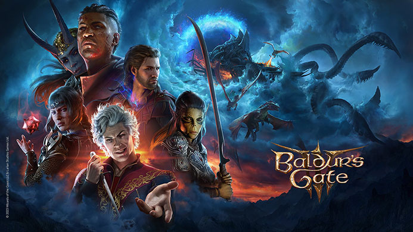
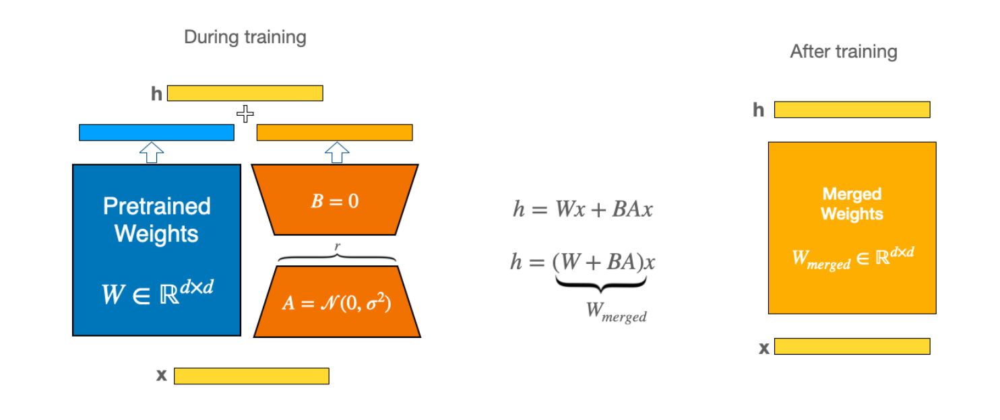
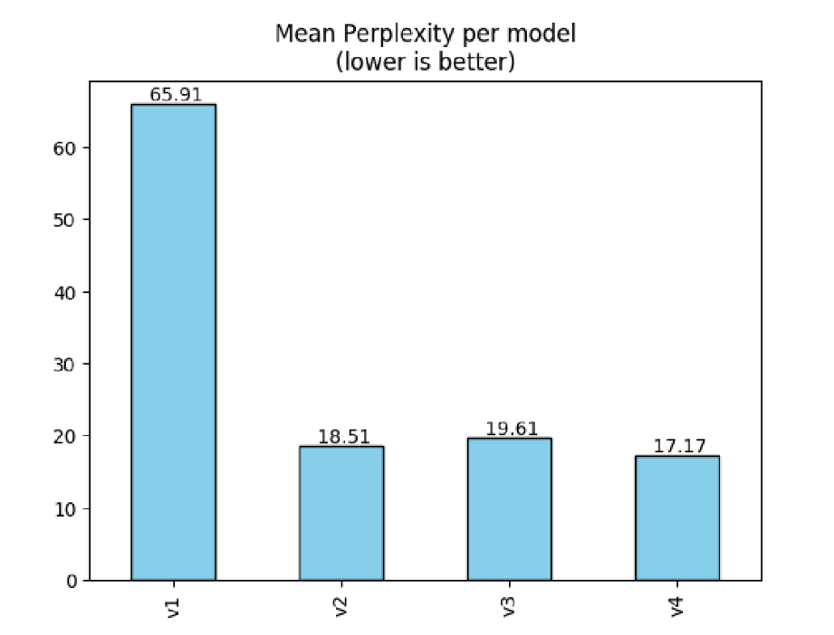

# LLM-steam-review-generator

<p align="center">
  
</p>


This repository contains the final project for our Data Science course in Winter 2024. The project fine-tunes the GPT-2 language model to generate and classify Steam reviews, specifically for the 2023 video game **"Baldur's Gate 3"**. 

Using **GPT-2** from Hugging Face and the LoRA (Low Rank Adaptation) fine-tuning technique, two separate models were created: one for generating new reviews and another for classifying the sentiment of reviews as positive or negative.

These models can also be found on HuggingFace: 
<br>[gpt2-lora-review-generation](https://huggingface.co/Mahan-M47/gpt2-lora-review-generation)
<br>[gpt2-lora-review-classification](https://huggingface.co/Mahan-M47/gpt2-lora-review-classification)


## Table of Contents

- [Overview](#overview)
- [Features](#features)
- [Project Structure](#project-structure)
- [Usage](#usage)
- [Dataset](#dataset)
- [Model Details](#model-details)
- [Results](#results)
- [Resources & References](#resources--references)
- [License](#license)


## Overview
The game industry receives a large amount of user-generated content, particularly in the form of reviews, which provides both a wealth of knowledge and a challenge in processing such large datasets. The study provides insight into GPT-2's ability to capture user feelings in game reviews, which has possible implications for natural language generation in the gaming industry. Using existing game reviews as training, the GPT-2 algorithm generates informative reviews that capture user sentiment. A subsequent GPT-2-based classifier classifies the generated reviews as either positive or negative.

A full report on the project is available in the `LLM - Steam Review Generator - Report.pdf` file.

## Features
- **Exploratory Data Analysis (EDA) and Visualization:** In-depth analysis and visualization of the dataset, offering insights into the review patterns.
- **Causal-based Review Generation:** A fine-tuned GPT-2 model that generates new Steam reviews for Baldur's Gate 3 based on a provided prompt.
- **Review Sentiment Classification:** A sequence classification model that determines whether a review is positive or negative.
- **Streamlit Web Application:** A user-friendly web interface to generate reviews and classify their sentiment.


## Project Structure

```
├── app.py             # The main application file.
├── requirements.txt   # A list of required libraries for running app.py
├── model/             # Contains model weights for the fine-tuned GPT-2 models.
├── dataset/           # Preprocessed datasets
└── notebooks/         # Jupyter notebooks for EDA, fine-tuning, and evaluation.
```

Note: If you plan to run the notebooks, place your Kaggle token inside the `.kaggle` folder. Ensure it is named `kaggle.json`.


## Usage
To run this project locally, follow these steps:
1. Clone the repository:
2. Install the required packages:
   ```bash
      pip install -r requirements.txt
    ```
3. Run the Streamlit app:
   ```bash
      streamlit run app.py
    ```

<br>Once the Streamlit app is running, the following features are available:
- **Generate Review:** Input a prompt related to Baldur's Gate 3, and the model will generate a corresponding Steam review. Leave the prompt empty to generate a fully random review.
- **Classify Review:** After a review has been generated, the model will classify it as either positive or negative.

<br>
<p align="center">
  
</p>


## Dataset
The dataset used in this project consists of all English-language Steam reviews for Baldur's Gate 3, which can be found [here](https://www.kaggle.com/datasets/harisyafie/baldurs-gate-3-steam-reviews). It contains more than 300’000 records of reviews from real Steam users who have purchased the video game on Steam. The dataset has been preprocessed and is available in the `dataset/` directory. 

Note that the raw dataset is not included due to size limitations, however running the `EDA - Preprocess.ipynb` notebook automatically downloads the full dataset, provided you have placed your Kaggle token.


### Exploratory Data Analysis & Preprocessing
Detailed analysis and visualizations were performed to understand the distribution of review sentiments, word frequency, and other insights. The EDA results are available in the notebooks provided.

Preprocessing the dataset involved multiple steps to determine the ideal features and select the most effective ones. These steps include Text Formatting, Feature engineering, and Profanity check.

Another important step is Data selection; where a limited collection of records were selected for the actual training process. We aimed to select the most helpful reviews, so out of all the remaining records, the top 10’000 were chosen based on their `weighted_vote_score`. This feature is calculated by Steam as an internal measure for review popularity.


## Model Details

### Architecture
With the aim of automated game review creation and sentiment classification, our model's architecture is based on the powerful GPT-2 language model.  GPT-2 is a self-supervised transformer model that was pre-trained on a huge corpus of English data. It was pre-trained on raw texts only, with no human labeling.

For our analysis, we choose the base version of GPT-2, which has 124M parameters. **GPT2ForSequenceClassification** and **AutoModelForCausalLM(gpt2)** are two different GPT-2 variations that we used, each designed to address different parts of this task.


### Tokenization
Tokenization is a key process in natural language processing that involves dividing a given text into smaller units called tokens. These tokens provide a structured representation of the text.
A tokenizer is in charge of tokenizing the inputs for a model. The `Tokenizer` library contains pre-trained tokenizers for all the models used in this project. We specifically used the `AutoTokenizer` class which automatically creates the corresponding tokenizer object for a given model.

### Fine-tuning
Our chosen fine-tuning approach includes Progressive Early Fine-Tuning (Peft) with a special focus on the **Low-Rank Adaptation (LoRA)** technique, which improves the GPT-2 model's adaptability for our goal while reducing the required processing power for fine-tuning GPT-2.

<br>
<p align="center">
  
</p>

### Versions
Four different versions of the Causal model and two different versions of the Classification model are available in the `model` directory. Refer to the `LLM - Steam Review Generator - Report.pdf` file for details on each version of the model.

Note that **Causal model v3** and **Classification model v2** performed best for their respective tasks.


## Results
The project successfully demonstrated the ability to generate and classify reviews for Baldur's Gate 3 using fine-tuned GPT-2 models. For this project, a total of 4 models were fine-tuned for Causal LLM, and 2 models were fine-tuned for Sequence Classification. Detailed results and model performance metrics can be found in the `LLM - Steam Review Generator - Report.pdf` file.

All 4 versions of the Causal LLM were evaluated using ROUGE and Perplexity. Intuitively, Perplexity means to be surprised. We measure how much the model is surprised by seeing new data. The lower the perplexity, the better the training is:

<br>
<p align="center">
  
</p>


## Resources & References
Dataset: [https://www.kaggle.com/datasets/harisyafie/baldurs-gate-3-steam-reviews](https://www.kaggle.com/datasets/harisyafie/baldurs-gate-3-steam-reviews)

GPT-2 model: [https://huggingface.co/openai-community/gpt2](https://huggingface.co/openai-community/gpt2)

Fine-tuning Large Language Models With LoRA: [https://youtu.be/eC6Hd1hFvos?si=qn59zpq0YTnzdjHI](https://youtu.be/eC6Hd1hFvos?si=qn59zpq0YTnzdjHI)


## License
This project is licensed under the MIT License. See the [LICENSE](LICENSE) file for more details.


