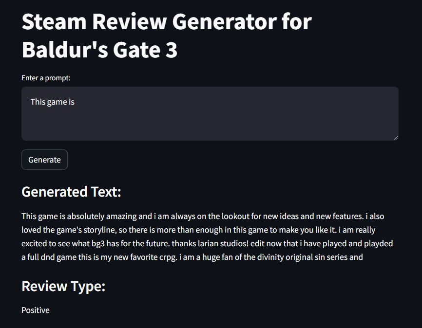

# LLM-steam-review-generator

<p align="center">
  
</p>

## Overview
This repository contains the final project for our Data Science course in Winter 2024. The project fine-tunes the GPT-2 language model to generate and classify Steam reviews, specifically for the 2023 video game **"Baldur's Gate 3"**. 

Using GPT-2 from Hugging Face and the LoRA fine-tuning technique, two separate models were created: one for generating new reviews and another for classifying the sentiment of reviews as positive or negative.


## Features
- **Exploratory Data Analysis (EDA) and Visualization:** In-depth analysis and visualization of the dataset, offering insights into the review patterns.
- **Causal-based Review Generation:** A fine-tuned GPT-2 model that generates new Steam reviews for Baldur's Gate 3 based on a provided prompt.
- **Review Sentiment Classification:** A sequence classification model that determines whether a review is positive or negative.
- **Streamlit Web Application:** A user-friendly web interface to generate reviews and classify their sentiment.


## Project Structure

```
├── app.py            # The main application file.
├── model/            # Contains model weights for the fine-tuned GPT-2 models.
├── dataset/          # Preprocessed datasets
├── notebooks/        # Jupyter notebooks for EDA, fine-tuning, and evaluation.
└── report.pdf        # A comprehensive report detailing the project
```

Note: If you plan to run the notebooks, place your Kaggle token inside the `.kaggle` folder. Ensure it is named `kaggle.json`.


## Dataset
The dataset used in this project consists of all English-language Steam reviews for Baldur's Gate 3, which can be found [here](https://www.kaggle.com/datasets/harisyafie/baldurs-gate-3-steam-reviews). The dataset has been preprocessed and is available in the `dataset/` directory. 

Note that the raw dataset is not included due to size limitations, however running the `EDA - Preprocess.ipynb` notebook automatically downloads the full dataset, provided you have placed your Kaggle token.


## Installation
To run this project locally, follow these steps:
1. Clone the repository:
2. Install the required packages:
   ```bash
      pip install -r requirements.txt
    ```
3. Run the Streamlit app:
   ```bash
      streamlit run app.py
    ```

## Usage
Once the Streamlit app is running, you can interact with the following features:
- **Generate Review:** Input a prompt related to Baldur's Gate 3, and the model will generate a corresponding Steam review. Leave the prompt empty to generate a fully random review.
- **Classify Review:** After a review has been generated, the model will classify it as either positive or negative.


## Model Details

### Architecture
With the aim of automated game review creation and sentiment classification, our model architecture is based on the powerful GPT-2 language model.  GPT-2 is a self-supervised transformer model that was pre-trained on a huge corpus of English data. This means that it was pre-trained on raw texts only, with no human labeling.

For our analysis, we choose the base version of GPT-2, which has 124M parameters. **GPT2ForSequenceClassification** and **AutoModelForCausalLM(gpt2)** are two different GPT-2 variations that we used, each designed to address different parts of our task:


### Tokenization & Fine-tuning approach

Our chosen approach fine-tuning approach includes Progressive Early Fine-Tuning (Peft) with a special focus on the Low-Rank Adaptation (LoRA) technique, which improves the GPT-2 model's adaptability for our goal objective.

### Versions

- **Causal LLM v1:** The first version of the generative model. This model is based on GPT-2 (using AutoModelForCausalLM) and was fine-tuned on 10’000 data points consisting of the most high-quality reviews in the dataset. However, the tokenization method used for it was not suitable, resulting in below-average performance, while also taking a significant amount of time.

- **Causal LLM v2:** The second iteration of the model, trained over 5 epochs. The tokenization strategy was completely changed for training this model. All of the input text of each record was concatenated to solve the padding issue. While this solution proved to be effective, the concatenation strategy created a number of other issues.
- **Causal LLM v3:** The third iteration of the model, using the same tokenization strategy as version 2, but missing the concatenation component. It was trained over 5 epochs and has generated acceptable results.
- **Causal LLM v4:** This model is the exact same as version 3, but instead of 5 epochs it was trained for 10 epochs. Based on loss values, it is slightly overfit and performs marginally worse than the previous version.

- **Classification model v1:** The first version of our classification model. This model is based on GPT-2 (using AutoModelForSequenceClassification) and was fine-tuned on the same 10’000 data points as the causal models. Due to the imbalance of negative and positive reviews in the dataset (with over 95 percent of the reviews being positive), this model isn’t capable of classification and reports all inputs as positive.
- **Classification model v2:** The second iteration of the classification model. This model was fine-tuned on a more balanced dataset with 5000 positive and 5000 negative records. It is surprisingly effective at classifying reviews (and other text formats) as being mostly negative or mostly positive. It can potentially be used in sentiment analysis tasks.


## Exploratory Data Analysis (EDA)
Detailed analysis and visualizations were performed to understand the distribution of review sentiments, word frequency, and other insights. The EDA results are available in the notebooks provided.


## Results
The project successfully demonstrated the ability to generate and classify reviews for Baldur's Gate 3 using fine-tuned GPT-2 models. Detailed results and model performance metrics can be found in the `report.pdf` file.

### Report Abstract:
The game industry receives a large amount of user-generated content, particularly in the form of reviews, which provides both a wealth of knowledge and a challenge in processing such large datasets. The study provides insight into GPT-2's ability to capture user feelings in game reviews, which has possible implications for natural language generation in the gaming industry. Using existing game reviews as training, the GPT-2 algorithm generates informative reviews that capture user sentiment. A subsequent GPT-2-based classifier classifies the generated reviews as either positive or negative.

<p align="center">
  
</p>


## Resources & References
Dataset: [https://www.kaggle.com/datasets/harisyafie/baldurs-gate-3-steam-reviews](https://www.kaggle.com/datasets/harisyafie/baldurs-gate-3-steam-reviews)

GPT-2 model: [https://huggingface.co/openai-community/gpt2](https://huggingface.co/openai-community/gpt2)

Fine-tuning Large Language Models With LoRA: [https://youtu.be/eC6Hd1hFvos?si=qn59zpq0YTnzdjHI](https://youtu.be/eC6Hd1hFvos?si=qn59zpq0YTnzdjHI)


## License
This project is licensed under the MIT License. See the [LICENSE](LICENSE) file for more details.


